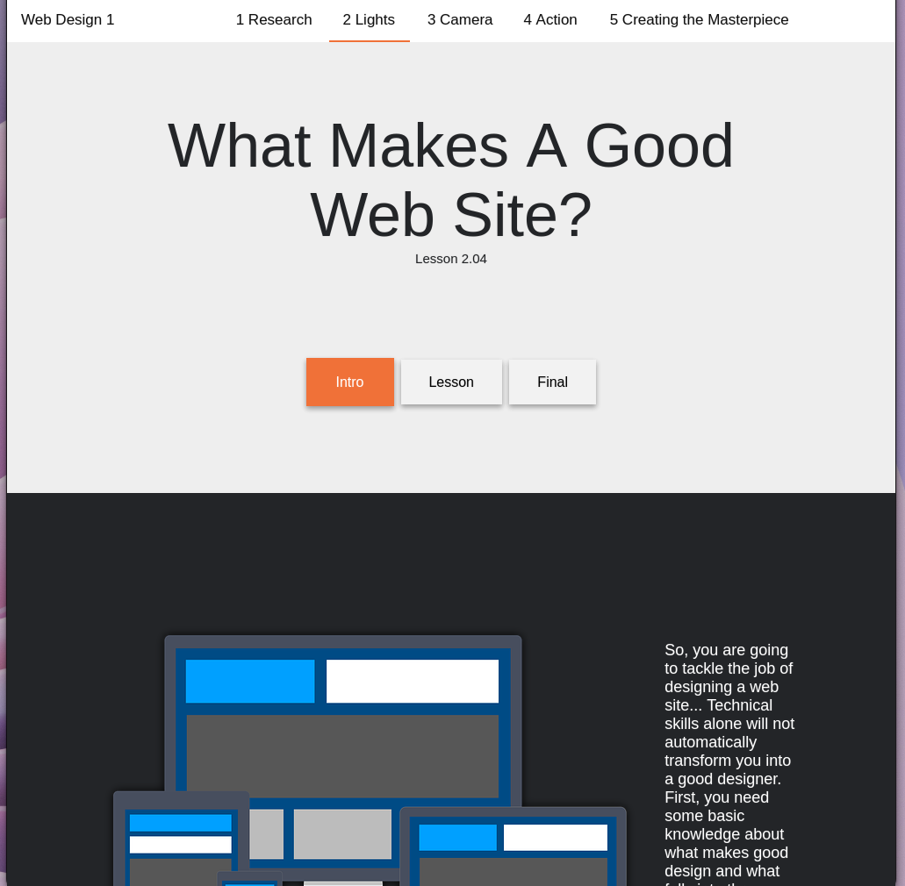
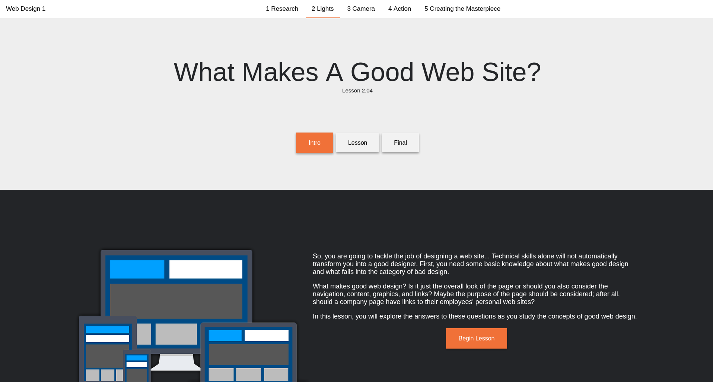

<!-- PROJECT SHIELDS -->
[![LinkedIn][linkedin-shield]][linkedin-url]

 

  

    Mock Website made purely with CSS and HTML
  

<!-- ABOUT THE PROJECT -->
## About The Project

Includes Mock text, images, functioning buttons, and 4 functional pages.
  - Home Page
    - `index.html`
  - Lights Lesson 
    - `intro.html`
    - `lesson.html`
    - `final.html`

(<a href="#top">back to top</a>)

### Responsive Design

 

### Built With

* [![HTML][HTML5]][HTML5-url]
* [![CSS][CSS]][CSS-url]

(<a href="#top">back to top</a>)

<!-- MARKDOWN LINKS & IMAGES -->
<!-- https://www.markdownguide.org/basic-syntax/#reference-style-links -->

[linkedin-shield]: https://img.shields.io/badge/-LinkedIn-black.svg?style=for-the-badge&logo=linkedin&colorB=555
[linkedin-url]: https://www.linkedin.com/in/jonathan-groberg
[HTML5]: https://img.shields.io/badge/HTML5-red?style=for-the-badge&logo=html5&logoColor=white
[HTML5-url]: https://developer.mozilla.org/en-US/docs/Glossary/HTML5
[CSS]: https://img.shields.io/badge/CSS-blue?style=for-the-badge&logo=css3&logoColor=white
[CSS-url]: https://developer.mozilla.org/en-US/docs/Web/CSS
